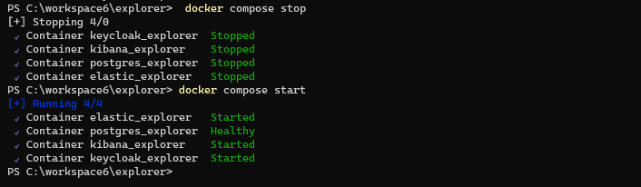

#### Pour la partie Docker Compose et ElasticSearch (Profile Spring local): 
Les datas ne sont pas chargées, par défaut, lors du lancement d'un Docker Compose (docker compose up -d). 

Pour charger les datas:   
- Soit vous lancez le script mapingElastic.sh manuellement, via Git Bash.    
  (cette démarche est la plus simple, mais vous aurez dans le réferentiel elastic un peu moins de 1000 spécimens, mais vous pouvez en ajouter d'autres à la fin du fichier specimen.ndjson   
  ou relancer le script autant de fois qu'il vous plaira, avec d'autres datas [au même format])       
 
>>  cd explorer/src/test/resources/logstash/scriptForLocal    
>>  ./mapingElastic.sh   

- Soit vous décommentez logstash, dans le fichier docker-compose.yaml ,avant lancement du Docker Compose (docker compose up -d)  
    
> . <u>Logstash va faire un appel JDBC</u> (Attention: vérifiez que les infos de la database (connection, user, pwd), défini dans le fichier /logstash/jdbc/logstash.conf, correspondent bien à votre database cible, et vérifiez si la requête convient (ainsi que la LIMIT de datas à charger).          
>>décommentez logstash avec la partie suivante:   
      
  - Ensuite lancez le Docker compose (docker compose up -d)  
  - Logstash est prévu pour se lancer toutes les trois minutes, après lancement du Docker compose.   
  - Faîtes un : 'docker stop logstash_collection', une fois vos datas chargés. 
  - Si vous avez l'intention de conserver l'environnement du  Docker compose (via start/stop), alors vous pouvez même supprimer le logstash_explorer, une fois vos datas chargés: 'docker remove logstash_collection'   
    
   
  
 
## Notes:   
### Remarque :
- une fois que vos datas sont chargées, vous pouvez conserver votre ensemble de containers (sans avoir à refaire l'opération à chaque fois).   
Il vous suffit d'employer les commandes 'start' et 'stop' , pour arrêter ou relancer l'ensemble des containers et conserver les datas insérées, pour vos essais locaux.   

>>    